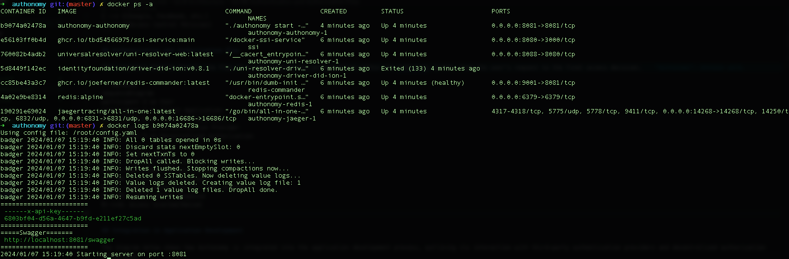
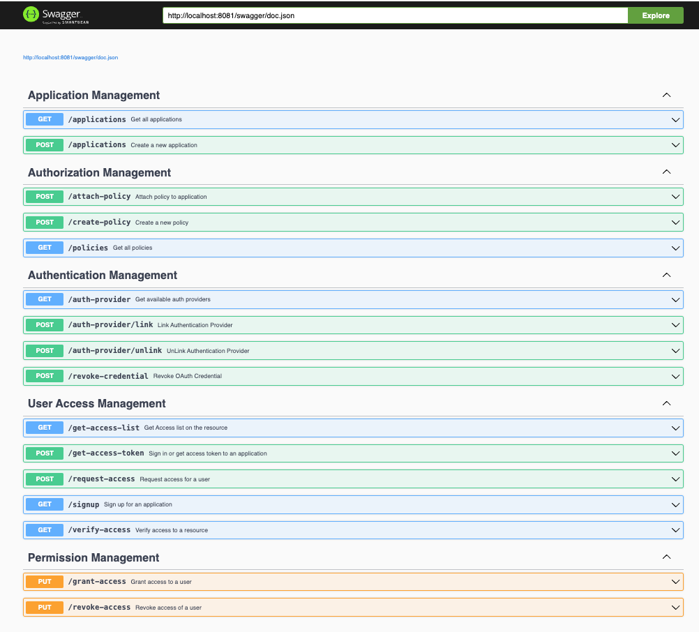

# Setup Guide

## Prerequisites

Docker and Docker-compose installed on your machine.

### Clone the repository

```sh
git clone https://github.com/singhhp1069/authonomy.git
cd authonomy
```

### Create a `config.yaml` file

- Use the provided configuration or adjust it according to your needs.
- Ensure the file is in the root directory of the project.

### Build and Run with Docker-Compose

- Use the docker-compose.yml file provided in the repository.
- Run the following command:

```sh
docker-compose up --build
```

### Get the API key and access the API in swagger

- check all the running containers and inspect authonomy service

```sh
docker ps -a
docker inspect {container_id}
```

you will get the api key for the service and the open api swagger url as show below in the image.



### Access the service

To access the service you can visit

```sh
http://localhost:8081/swagger
```

and use the `x-api-key` what you got from the previous step.



As a developer the further steps:

1. Setting up an application
2. Link the Authentication Provider (e.g., facebook)
3. Attach policy to the application (e.g., RBAC schema policy)
4. Now you are ready to use it on application.

### SDK and Demo

- sdk can be found here [sdk](https://github.com/singhhp1069/authonomy-sdk-js)
- demo repository can be found here [demo](https://github.com/singhhp1069/authonomy-demo)

Complete demo video is:

TODO:: video link
