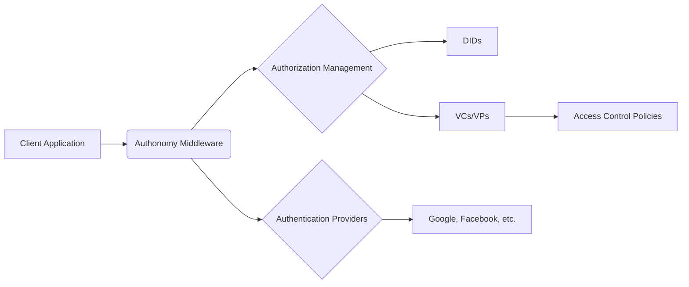
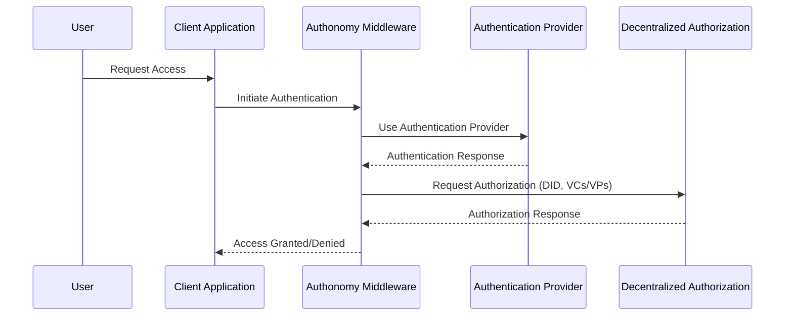
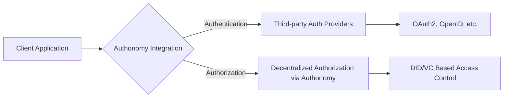

# Authonomy System Architecture

## Overview

This document provides an architectural overview of Authonomy, an innovative middleware designed to revolutionize authorization management for application developers. Authonomy separates authentication from authorization, leveraging decentralized authorization through DIDs, VCs, and VPs.

## System Architecture

### Overall System Architecture

The following diagram illustrates the high-level architecture of Authonomy, showing how it integrates with client applications, authentication providers, and handles authorization management.



## Authentication and Authorization Flow

This sequence diagram details the flow of authentication and authorization within the Authonomy system, from the user's request to the final access decision.



## Decentralized Authorization Process

This graph demonstrates the process of decentralized authorization in Authonomy, highlighting the roles of policy engines, blockchain/DLT, and VC services.

```mermaid
graph TD
A[Application Request] -->|DID/VCs| B[Authonomy Middleware]
B -->|Verify Policies| C[Policy Engine]
C -->|Policy Decision| D[Access Granted/Denied]
B -->|Manage DIDs| 
B -->|Issue/Validate VCs| F[VC Service]
```

## Integration in Application Development

The diagram below shows how Authonomy is integrated into the application development process, outlining its interaction with third-party authentication providers and decentralized authorization mechanisms.



## Conclusion

Authonomy introduces a novel approach to digital identity management by separating authentication and authorization. Its architecture leverages modern decentralized technologies to provide a flexible, secure, and user-centric solution for application developers.
